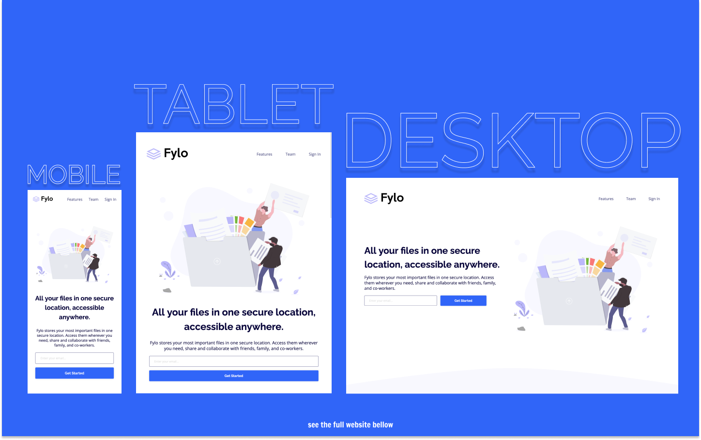

# Frontend Mentor - Fylo Landing Page Solution

This is a solution to the [Fylo Landing Page Challenge on Frontend Mentor](https://www.frontendmentor.io/challenges/fylo-landing-page-with-two-column-layout-5ca5ef041e82137ec91a50f5).

## Table of contents

- [Overview](#overview)
  - [The challenge](#the-challenge)
  - [Screenshot](#screenshot)
  - [Links](#links)
- [My process](#my-process)
  - [Built with](#built-with)
  - [What I learned](#what-i-learned)
- [Author](#author)

## Overview

### The challenge

Users should be able to:

- View the optimal layout for the site depending on their device's screen size
- See hover states for all interactive elements on the page
- Show an error message if the user types an invalid email

### Screenshot

### Links

- Live Site URL: [https://kens-visuals.github.io/fylo-landing-page/](https://kens-visuals.github.io/fylo-landing-page/)
- Solution URL: [TO_BE_UPDATED](TO_BE_UPDATED)

## My process

### Built with

- Semantic HTML5 markup
- SCSS custom properties
- CSS Flexbox
- CSS Grid
- Vanilla JS
- Mobile-first workflow

### What I learned

This project brought me closer to the end of the **JUNIOR** level. There's only one project left and a couple of days till the end of the year. Which means that I'm so very close to achieving my goal of finishing every challenge in this JUNIOR level. Not a lot to say about this project, the only challenge I had was the pattern img, but it wasn't much of challenge at the end of the day. One more challenge and I can call it a year!

## Author

- Frontend Mentor - [@kens-visuals](https://www.frontendmentor.io/profile/kens-visuals)
- Codewars - [@kens_visuals](https://www.codewars.com/users/kens_visuals)
- CodePen - [@kens-visuals](https://codepen.io/kens-visuals)
